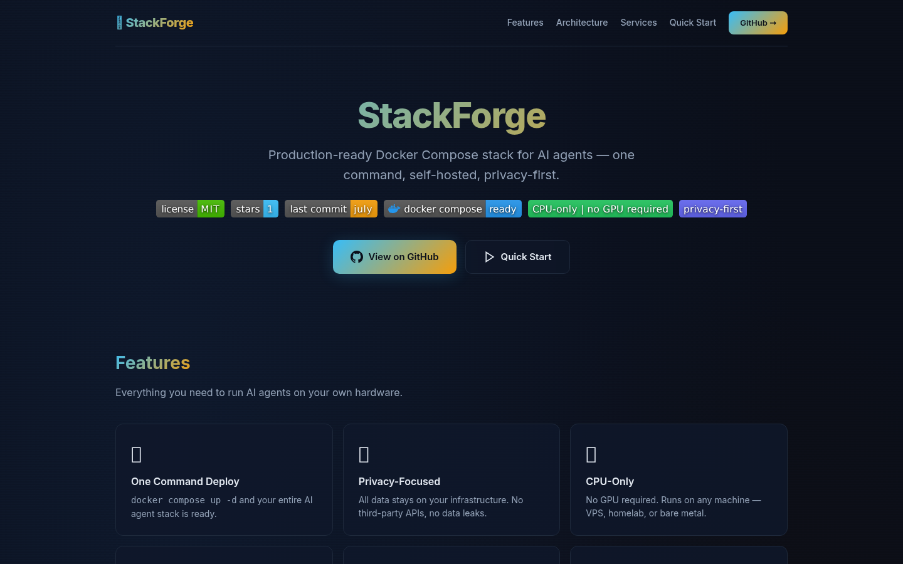

<div align="center">

# ⛓ StackForge

**Production-ready Docker Compose stack for AI agents**  
One command. Self-hosted. Privacy-first. No GPU required.

[](LICENSE)
[](https://github.com/OneByJorah/StackForge/releases)
[](https://github.com/OneByJorah/StackForge/stargazers)
[](https://github.com/OneByJorah/StackForge/commits)
[](https://docs.docker.com/compose/)
[](https://ollama.com)
[](https://github.com/OneByJorah/StackForge)

<br>




<br>

[Getting Started](#-quick-start) •
[Architecture](#-architecture) •
[Services](#-services) •
[Configuration](#-configuration) •
[Contributing](#-contributing)

</div>

---

## ✨ Features

| Feature | Description |
|---------|-------------|
| **One Command Deploy** | `docker compose up -d` and your entire AI agent stack is ready |
| **CPU-Only** | No GPU required — runs on any VPS, homelab, or bare metal machine |
| **Privacy-Focused** | All data stays on your infrastructure. No third-party APIs, no data leaks |
| **Local LLMs** | Ollama-powered language models (Llama 3, Mistral, Phi, etc.) |
| **Vector Database** | Qdrant for high-performance embedding storage and similarity search |
| **Agent Memory** | Honcho provides long-term persistent memory for AI agents |
| **Private Search** | SearXNG aggregates web search without tracking or profiling |
| **Obsidian Sync** | CouchDB-backed LiveSync for notes, knowledge, and agent vaults |
| **Web Automation** | Selenium standalone Chrome for browser automation tasks |
| **P2P File Sync** | Syncthing for laptop-to-server vault synchronization |

## 🏗 Architecture

```
                   ┌─────────────┐
                   │  AI Agent   │
                   └──────┬──────┘
                          │
                   ┌──────┴──────┐
                   │  API Layer  │
                   └──────┬──────┘
                          │
          ┌───────────────┼───────────────┐
          │               │               │
    ┌─────┴─────┐   ┌────┴────┐   ┌──────┴──────┐
    │  Ollama   │   │ Qdrant  │   │   Honcho    │
    │  :11434   │   │ :6333   │   │   :8000     │
    │ LLM Host  │   │ Vector  │   │   Memory    │
    └───────────┘   │   DB    │   └──────┬──────┘
                    └─────────┘          │
                                  ┌──────┴──────┐
                                  │  PostgreSQL │ Redis
                                  │  :5432      │ :6379
                                  └─────────────┘

    ┌──────────┐   ┌──────────┐   ┌─────────────┐
    │ SearXNG  │   │ Obsidian │   │  Selenium   │
    │ :8080    │   │ :8083    │   │  :4444      │
    │ Search   │   │ Vault    │   │  Automation │
    └──────────┘   └──────────┘   └─────────────┘
```

## 🛠 Services

| Service | Port | Purpose | Image |
|---------|------|---------|-------|
| **Ollama** | `11434` | Local LLM hosting (Llama, Mistral, Phi, etc.) | `ollama/ollama` |
| **Qdrant** | `6333` | Vector database for embeddings | `qdrant/qdrant` |
| **Honcho** | `8000` | Long-term agent memory API | `ghcr.io/plastic-labs/honcho` |
| **SearXNG** | `8080` | Privacy-respecting meta search engine | `searxng/searxng` |
| **PostgreSQL** | `5432` | Relational database (Honcho backend) | `pgvector/pgvector:pg15` |
| **Redis** | `6379` | Caching and message queues | `redis:8.2` |
| **CouchDB** | `5984` | Obsidian LiveSync document store | `couchdb:3.4` |
| **Obsidian** | `8083` | Web vault viewer (Caddy) | `caddy:2-alpine` |
| **Syncthing** | `8384` | P2P file sync (laptop ↔ server) | `syncthing/syncthing` |
| **Selenium** | `4444` | Browser automation (Chrome) | `selenium/standalone-chrome` |

## 🧰 Tech Stack

- **Runtime:** Docker & Docker Compose
- **LLM:** Ollama (local, no cloud dependencies)
- **Vector DB:** Qdrant
- **Memory Layer:** Honcho + pgvector + Redis
- **Search:** SearXNG
- **Notes & Sync:** Obsidian + CouchDB LiveSync + Syncthing
- **Automation:** Selenium standalone Chrome
- **Networking:** Tailscale (recommended), internal bridge networks

## 🚀 Quick Start

```bash
# Clone the repo
git clone https://github.com/OneByJorah/StackForge.git
cd StackForge

# Copy environment template
cp .env.example .env

# Deploy the entire stack
docker compose up -d

# Check service health
./scripts/healthcheck.sh
```

### Access Services

| Service | URL |
|---------|-----|
| Ollama API | `http://localhost:11434` |
| Qdrant Dashboard | `http://localhost:6333/dashboard` |
| Honcho API | `http://localhost:8000` |
| SearXNG | `http://localhost:8080` |
| Obsidian Vault | `http://localhost:8083` |
| Syncthing UI | `http://localhost:8384` |
| CouchDB | `http://localhost:5984/_utils` |

## 🔧 Configuration

| Variable | Default | Description |
|----------|---------|-------------|
| `SERVER_IP` | *(required)* | Host IP used in service URLs (Tailscale IP recommended) |
| `HONCHO_DB_PASSWORD` | `changeme` | PostgreSQL password (Honcho backend) — **change it** |
| `HONCHO_TOKEN` | *(required)* | Honcho API auth token |
| `QDRANT_PORT` | `6333` | Qdrant API port |
| `SVC_HONCHO_PORT` | `8000` | Honcho API port |
| `SVC_SEARXNG_PORT` | `8080` | SearXNG port |
| `COUCHDB_ADMIN_USER` | `admin` | CouchDB admin username |
| `COUCHDB_ADMIN_PASSWORD` | `changeme` | CouchDB admin password — **change it** |

Full reference in [`.env.example`](.env.example).

## 📁 Project Structure

```
StackForge/
├── docker-compose.yml            # Main compose file (all services)
├── docker-compose.headroom.yml   # Headroom monitoring add-on
├── docker-compose.portainer.yml  # Portainer container management
├── .env.example                  # Environment variable template
├── bootstrap.sh                  # Interactive first-run setup wizard
├── index.html                    # Landing page
├── docs/
│   └── assets/                   # Screenshots, banners, diagrams
├── scripts/
│   ├── healthcheck.sh            # Service health monitoring
│   ├── bootstrap.sh              # Initial system bootstrap
│   ├── install.sh                # Installation script
│   ├── init-honcho.sh            # Honcho initialization
│   ├── init-obsidian.sh          # Obsidian vault init
│   ├── init-headroom.sh          # Headroom stack init
│   └── install-browser-search.sh # Browser search tool setup
├── searxng/                      # SearXNG configuration
├── honcho/                       # Honcho config
├── headroom/                     # Headroom config
├── obsidian/                     # Obsidian vault + Caddyfile
├── obsidian-skills/              # Obsidian plugin skills
├── noc-dashboard/                # NOC monitoring dashboard
│   ├── frontend/                 # Dashboard UI
│   └── backend/                  # Dashboard API
├── browser-search/               # Browser search utilities
├── skills/                       # AI agent skill definitions
├── vendor/                       # Vendor dependencies
└── tests/                        # Integration tests
```

## 📊 Hardware Requirements

| Scale | CPU | RAM | Storage | Use Case |
|-------|-----|-----|---------|----------|
| **Basic** | 4 cores | 8 GB | 50 GB | Personal agent, light usage |
| **Standard** | 8 cores | 16 GB | 100 GB | Multi-agent, moderate load |
| **Performance** | 16 cores | 32 GB | 200 GB+ | Heavy inference, many agents |

## 🤝 Contributing

Contributions are welcome! Please see [CONTRIBUTING.md](CONTRIBUTING.md) for guidelines and [CODE_OF_CONDUCT.md](CODE_OF_CONDUCT.md) for community standards.

## 🔒 Security

Found a vulnerability? Please follow our [Security Policy](SECURITY.md) and report privately to **info@jorahone.com** — do not use public issues.

## 📄 License

[MIT License](LICENSE) © Jhonattan L. Jimenez (OneByJorah)

---

<div align="center">Built with 🌴 by <a href="https://github.com/OneByJorah">OneByJorah</a> · <a href="https://jorahone.com">jorahone.com</a></div>
